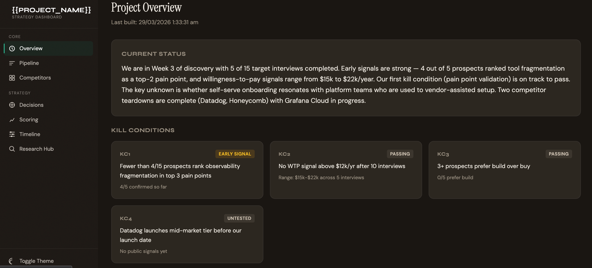

# DS Strategy Stack (Claude Code)

> An open-source, AI-powered strategy and project management stack for Claude Code. Clone it, run `/onboard`, and start doing real work — market entry, competitor research, internal implementations, due diligence, or any corporate project that needs structured thinking.

[](LICENSE)

---

## What Is This?

A complete strategy project framework that runs inside [Claude Code](https://claude.ai/code). It gives you:

- **14 skills** that automate strategy workflows (research, discovery, analysis, reporting)
- **A live dashboard** (Vercel-deployable) showing kill conditions, pipeline, competitors, decisions, and more
- **A memory layer** that persists strategic context across sessions
- **Multi-agent coordination** so multiple Claude instances can work on the same project
- **Evidence grading** on every claim — `[CONFIRMED]`, `[SECONDARY]`, `[INFERENCE]`, `[ASSUMPTION]`
- **Kill condition tracking** — falsifiable thresholds that tell you when to stop or pivot

No boilerplate. No blank-page problem. Clone, configure, and go.



---

## Quick Start

### Option A: npx (recommended)

```bash
npx create-dss-project my-project
cd my-project
claude
/onboard
```

The scaffolder asks 3 questions (project name, type, structure level) and sets up a ready-to-go project with the right modules pre-configured.

### Option B: Git clone

```bash
git clone https://github.com/DiffTheEnder/DSS-Claude-Stack.git my-project
cd my-project
claude
/onboard
```

Both paths end at `/onboard`, which walks you through the full configuration — **Quick Start** (7 questions) or **Full Setup** (16 questions). It asks about your goals, experience level, and which features you want, then generates your `project.config.json`, populates placeholders, and activates the right modules.

> **New to coding?** See the [Getting Started Guide](docs/getting-started.md) for step-by-step instructions covering installation, setup, and Vercel deployment — no programming knowledge needed.

---

## Features

### Skills Library (14 skills)

| Skill | Phase | Description |
|-------|-------|-------------|
| `/onboard` | Setup | One-time project configuration wizard |
| `/session-start` | Session | Load context, check conflicts, show priorities |
| `/session-end` | Session | 10-step end-of-session housekeeping |
| `/health-check` | Quality | Project integrity audit and health score |
| `/rebuild-snapshots` | Session | Regenerate all context snapshots from raw files |
| `/pipeline-update` | Pipeline | Track entity status transitions |
| `/outreach-sequence` | Pipeline | Design multi-touch outreach cadences |
| `/process-call` | Discovery | Post-discovery-call structured processing |
| `/enrich-entity` | Research | Deep research and dashboard enrichment for an entity |
| `/synthesise` | Research | Cross-file research synthesis into structured memos |
| `/critical-reasoning` | Analysis | Pressure-test ideas with 4 lenses: truth, consequences, risks, feasibility |
| `/decision` | Analysis | Record strategic decisions with full rationale |
| `/compare-options` | Analysis | Score and compare 2–5 strategic options |
| `/weekly-report` | Reporting | Generate stakeholder-ready weekly summaries |

### Live Dashboard

- **7 pages**: Overview, Pipeline, Competitors, Decisions, Scoring, Timeline, Research Hub
- Warm cream/teal editorial design with dark mode
- Auto-rebuilds from markdown/CSV source files
- Deploys to Vercel on push

### Memory & Context System

- **5 persistent memory files** tracking research, discovery, decisions, and scoring
- **4 pre-computed context snapshots** for fast session loading
- **Three loading modes**: Fast, Standard, Deep — so you only load what you need

---

## Architecture

```
my-project/
├── CLAUDE.md                 # Agent instructions & context loading rules
├── STATUS.md                 # Multi-agent coordination board
├── project.config.json       # Project configuration (generated by /onboard)
├── memory/                   # Persistent strategic memory
├── context/                  # Pre-computed snapshots for fast loading
├── templates/                # Standard formats (call-prep, call-notes, entity-teardown)
├── research/                 # Raw research files (competitors, market, technical)
├── discovery/                # Customer/stakeholder discovery [optional]
├── data/                     # CSV/JSON source of truth
├── skills/                   # Project-level Claude Code skills
├── dashboard/                # Live web dashboard (Vercel-deployed)
├── docs/                     # Executive summary, memos, reports
└── scripts/                  # Utility scripts
```

---

## What Can You Ask Claude?

Beyond the built-in skills, you can talk to Claude in plain English. The stack gives Claude the context it needs to answer strategically — your research, pipeline, decisions, and hypothesis are all loaded into memory. Here are some things you might say:

### Research & Analysis

> "Here's my meeting transcript from the call with Acme Corp. Can you analyse this against my existing research to see what it means for our current hypothesis?"

> "Pull together everything we know about the competitive landscape and tell me where the biggest white space is."

> "I just found this industry report — read it and update our competitor research with anything new."

> "What are the strongest and weakest parts of our hypothesis right now? What evidence are we missing?"

### Discovery & Pipeline

> "I have 3 new leads from a conference. Add them to the pipeline and draft a personalised outreach sequence for each."

> "Based on all the discovery calls so far, what patterns are emerging? Are we hearing the same pain points?"

> "Prep me for my call with Nexus Payments tomorrow — what do we know about them and what should I ask?"

### Decision-Making

> "We need to decide between building our own data pipeline vs. using a third-party vendor. Set up a comparison with the pros, cons, and scores."

> "Play devil's advocate on our go-to-market strategy. What are we not seeing?"

> "We're about to commit to a product-led growth motion. Pressure-test this before we lock it in."

### Reporting & Status

> "Write a 2-paragraph update I can send to the board summarising where we are this week."

> "What's changed since last Monday? Give me a diff of all research and decisions."

> "How close are we to hitting any of our kill conditions?"

These are just starting points — you can ask Claude anything about your project and it will draw on the full context of your research, pipeline, and decisions to answer.

---

## Project Types

The `/onboard` wizard configures the stack based on your project type:

| Type | Discovery | Pipeline | Dashboard | Best For |
|------|:---------:|:--------:|:---------:|----------|
| Market Entry | Yes | Yes | Yes | New market or product evaluation |
| Growth Strategy | Yes | Yes | Yes | Existing product, new channels or segments |
| Competitor Research | No | No | Yes | Competitive intelligence and landscape mapping |
| Product Launch / GTM | Yes | Yes | Yes | Bringing a product or feature to market |
| Internal Implementation | No | Yes | Yes | Rolling out a system, process, or initiative |
| Vendor / Partner Evaluation | Yes | Yes | Yes | Selecting tools, platforms, or partners |
| Due Diligence | Yes | Yes | Yes | M&A, investment, or acquisition evaluation |
| Business Case | No | No | Optional | Building a case for investment or change |
| Transformation / Change | Yes | Yes | Yes | Organisational or process transformation |
| Custom | Choose | Choose | Choose | Anything else |

---

## Requirements

- [Claude Code](https://claude.ai/code) CLI
- Node.js 18+ (for dashboard)
- Git

---

## Documentation

- **[Getting Started Guide](docs/getting-started.md)** — step-by-step setup for non-technical users (install, configure, deploy)
- [Dashboard Deployment](dashboard/DEPLOY.md) — quick reference for deploying to Vercel
- [Executive Summary Template](docs/executive-summary.md) — master hypothesis and strategy memo
- [Evidence Grading Rules](docs/memos/evidence-grading.md) — how claims are tagged and verified
- [Skill Authoring Guide](docs/skill-authoring-guide.md) — build your own skills for the stack
- [Dashboard Architecture](dashboard/CLAUDE.md) — how the dashboard reads, builds, and renders data

---

## Contributing

Contributions are welcome. Please see [CONTRIBUTING.md](CONTRIBUTING.md) for guidelines on submitting issues, proposing features, and opening pull requests.

---

## Licence

MIT — see [LICENSE](LICENSE).
